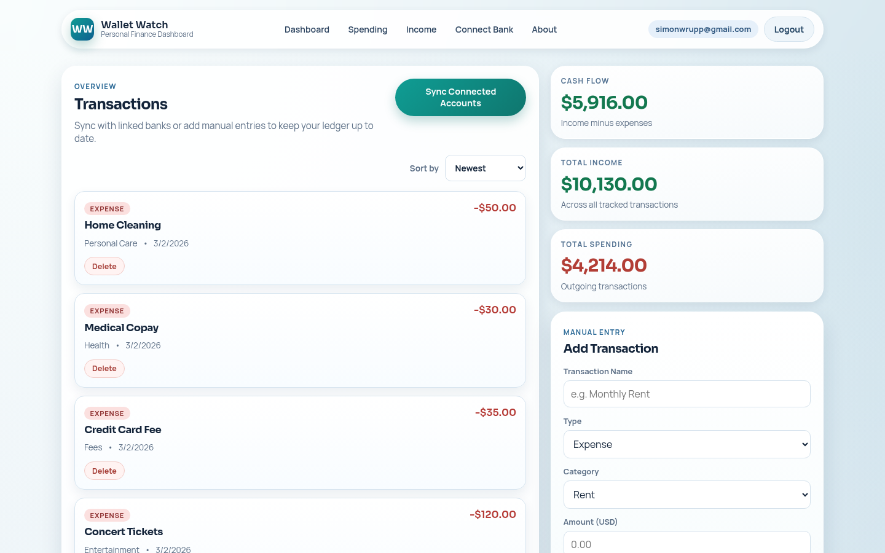
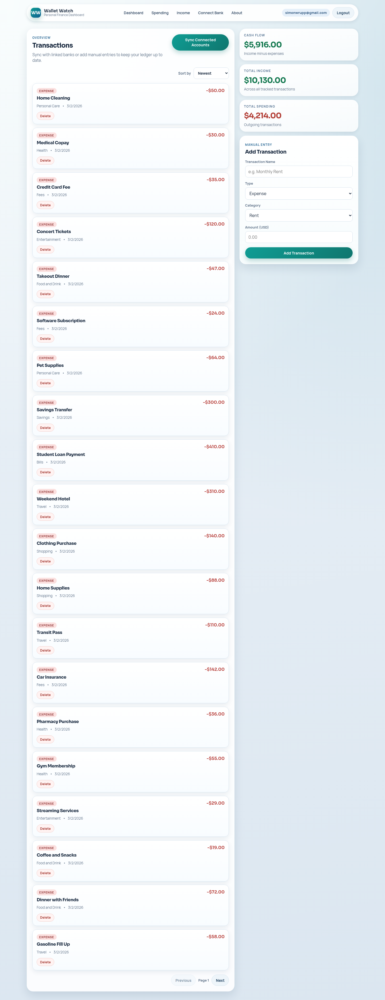
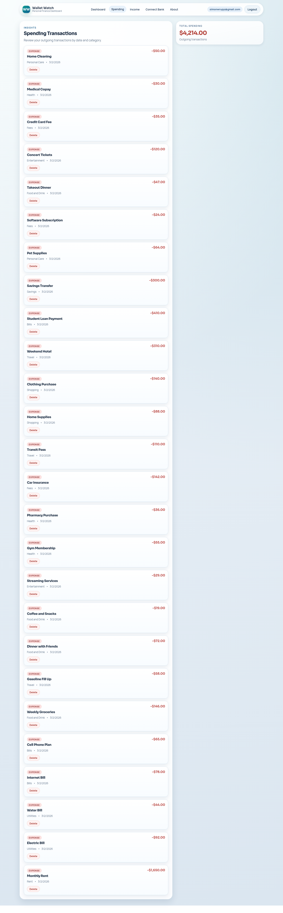
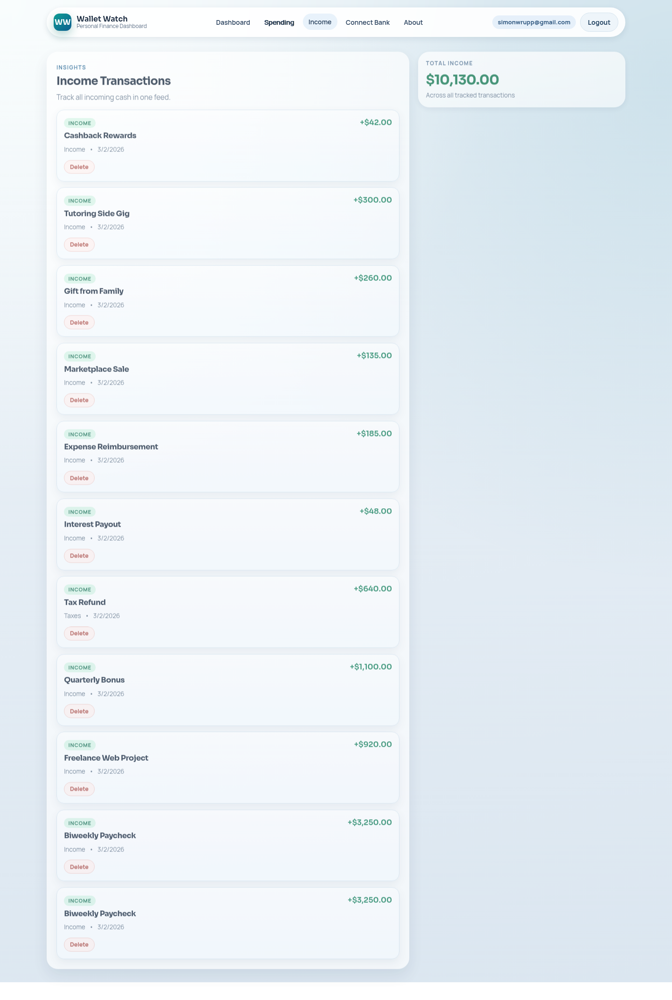
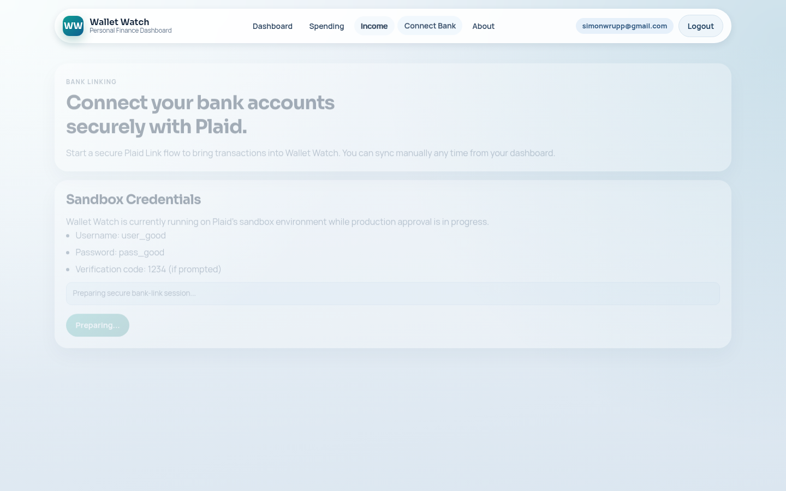
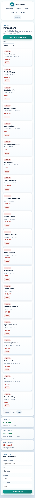

# Wallet Watch

Wallet Watch is a legacy MERN + Plaid app for tracking spending, income, and cash flow.

## Repository Layout

- `backend/`: Express + MongoDB API (auth, transactions, Plaid sync)
- `frontend/`: React (Vite) client
- `AGENTS.md`: modernization handoff and phased upgrade plan

## Prerequisites

- Node.js 18.x
- npm 9+
- MongoDB database (local or Atlas)
- Plaid sandbox credentials (optional unless testing bank-link flows)

## Local Setup

### 1) Configure environment variables

Backend:

```bash
cp backend/.env.example backend/.env
```

Fill in `backend/.env` values before running the API.

Frontend:

```bash
cp frontend/.env.example frontend/.env
```

Set `VITE_API_BASE_URL` to your backend origin (for local dev: `http://localhost:4000`).

### 2) Install dependencies

```bash
cd backend && npm ci
cd ../frontend && npm ci
```

### 3) Start development servers

Backend:

```bash
cd backend
npm run dev
```

Frontend:

```bash
cd frontend
npm run dev
```

The Vite dev server runs on `http://localhost:5173` by default.

## Tests

Backend smoke tests cover:

- auth register/login
- transaction create/read/update/delete
- auth requirement on protected routes

Run:

```bash
cd backend
npm test
```

## UI Screenshots

The screenshots below were captured from the live deployment after seeding realistic sample data (multiple income entries and a larger set of expenses) via Playwright automation.

### Dashboard Overview



### Dashboard Full (Transaction Feed)



### Spending Page



### Income Page



### Connect Bank Page



### Dashboard Mobile



## Deployment Direction

Current modernization target is:

- Frontend: Vercel (Hobby)
- Backend: Render free web service
- Database: MongoDB Atlas M0

Track progress in `AGENTS.md`.
